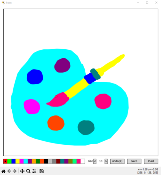
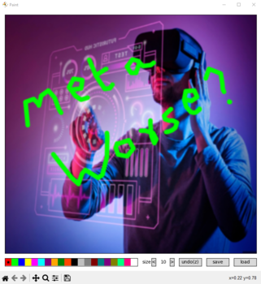

# Simple Drawing Tool

simple matplotlib based drawing tool!

created demo images:

This tool is quite handy for simple drawings. You can change colors, adjust marker size, and undo your work. Plus, it lets you save and reopen your drawings. And if you want to get creative, you can import an image and doodle on it too.